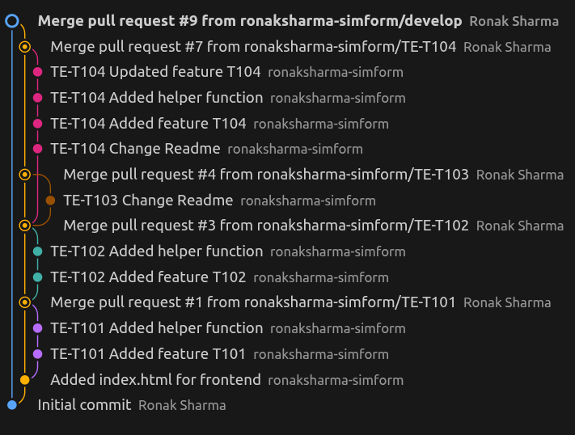

# Git Assessment Project

## Overview
This repository is created as part of a Git assessment to demonstrate practical knowledge of Git and Git Flow–based development. It showcases a complete task-based workflow using feature branches, structured commit messages, and pull-request–driven integration.

The repository includes examples of:

- Git Flow branching (`main`, `develop`, and feature branches)
- Task-based feature development using Zoho Task IDs
- Commit message enforcement using a local `commit-msg` hook
- Parallel feature development while pull requests are under review
- Advanced Git operations such as `rebase`, `cherry-pick`, `amend`, `reset`, and tagging
- Release versioning using annotated Git tags
- Merging changes through Pull Requests instead of direct merges


All Git commands executed during the assessment are documented in the README to provide clear traceability between actions performed and the resulting repository history.

## Branching Strategy

### Main Branches
- **main** — Production-ready and stable code (merged from `develop`)
- **develop** — Integration branch for completed features; base for feature branches

### Feature Branches
Feature branches are created from `develop` and named using the Zoho Task ID.

**Naming Convention**

TE-T<task-id>

**Examples**

TE-T101
TE-T102
TE-T103
TE-T104

## Development Workflow

1. Create a feature branch from `develop`
2. Make incremental commits with proper task ID
3. Open a Pull Request to `develop`
4. Review and merge the Pull Request
5. Periodically merge `develop` into `main` for release

## Commit Message Convention

All commit messages must include the Zoho Task ID.

**Format**
TE-T<task-id> <short description>

**Examples**

TE-T104 Added feature T104
TE-T102 Added helper function
TE-T103 Change Readme

## Git Operations Used

| Operation      | Purpose                                  |
|----------------|------------------------------------------|
| Rebase         | Keep feature branch up to date with develop |
| Squash         | Clean commit history before PR merge     |
| Cherry-pick    | Apply specific commits across branches   |
| Reset          | Amend or remove unwanted commits         |
| Merge          | Use via Pull Requests                    |

## Release & Versioning

**Tag Example**
v1.0.0
v1.1.0

### Git Flow Diagram



### Initial Setup 

## Initial Setup

The repository was created using an **existing template repository** to provide a consistent project structure and predefined configurations for the assessment.

After creating the repository from the template, it was cloned to the local development environment to begin feature development and Git operations.


```bash
# Clone the repository to your local machine
git clone https://github.com/ronaksharma-simform/git_assessment

# Navigate into the project directory
cd git_assessment

```


## Git Flow Task Walkthrough

This walkthrough documents the exact sequence of git operations you requested, grouped by task. For each step I include the commands used and placeholders where you can add task IDs, commit hashes, PR links and screenshots.

Overview of the scenario (what we do):

- Create a branch from `develop` and make commits.
- Add a `commit-msg` hook locally to enforce commit-message format.
- Create a PR to `develop` (small PR recommended).
- Create another branch from `develop` while first PR is in review.
- Push commits to the current branch; the earlier PR gets merged into `develop` meanwhile.
- Update (rebase/merge) the current branch to be up-to-date with `develop` and create PR.
- Tag releases on commits.
- Create two more branches (3rd & 4th), push README changes to 3rd, cherry-pick that commit into 4th, change the commit message in 4th, add 3 commits and delete the last commit.

---

### A. Create branch from `develop`

Commands used:

```bash
git checkout develop
git pull origin develop
git checkout -b TE-T101
```


### B. Add a `commit-msg` hook (local)

Create a hook to check if commit msg starts with TE-T[0-9] then commit the changes else stop the commit

```bash
cat > .git/hooks/commit-msg <<'HOOK'
#!/bin/sh
# code to check whether the commit message follow the formal template or not .
COMMIT_MSG_FILE="$1"
COMMIT_MSG=$(cat "$COMMIT_MSG_FILE")
echo "$COMMIT_MSG"
# Pattern for TE-T102, TE-T1, etc.
TASK_PATTERN="^TE-T[0-9]+"
 
if ! echo "$COMMIT_MSG" | grep -qE "$TASK_PATTERN"; then
  echo "❌ Commit rejected!"
  echo "👉 Commit message must start with a Task ID like:"
  echo "   TE-T102 Fix login issue"
  exit 1
fi
echo "Changes are commited sucessfully"
exit 0
HOOK
chmod +x .git/hooks/commit-msg
```

### C. Perform multiple commits in the new branch

Commands used:

```bash
git add index.js
git commit -m "TE-T101 Added feature T101 "
git add index.js
git commit -m "TE-T101 Added helper function "
git push -u origin TE-T101
```

### D. Create PR to `develop`

Used Github UI to create the PR.

### E. Create another branch from `develop` and commit changes and push the changes given your previous PR is still in review state 
Commands Used :
```bash
git checkout develop
git pull origin develop
git checkout -b TE-T102
git add index.js
git commit -m "TE-T102 Added helper function"
git push -u origin TE-T102
```

### F. First PR merged into `develop` while you continue on second branch

Merged the PR through GitHub UI and pull the changes 

```bash
git checkout develop
git pull origin main
```

### G. Create a PR for the current branch given your branch should be up to date with develop branch

Used rebase command to get the changes from develop branch, solved merge conflict and push the code .

```bash
git checkout TE-T102
git rebase develop
git add .
git rebase --continue
git push origin TE-T102
```
Created PR to develop branch through Github UI.

### G. Tagging a release

Adding a tag to show the current version of our product:

```bash
git tag -a v1.0 -m "First Production release"
git push origin v1.0
```

### H. Create 2 another branch (3rd and 4th) from develop, push read me changes to 3rd brach.

```bash
git checkout develop
git pull origin develop
git checkout -b TE-T103
# edit README.md
git add README.md
git commit -m "TE-T103 Change Readme"
git push -u origin TE-T103

git checkout develop
git pull origin develop
git checkout -b TE-T104
```

### I. Cherry-pick 3rd branch commit into 4th branch

Find the commit hash from the 3rd branch:

```bash
git log TE-T103 --oneline
```

Then on the 4th branch:

```bash
git checkout TE-T104
git cherry-pick 2389add
```

### J. Change commit message in 4th branch

To change the most recent commit message:

```bash
git commit --amend 
```
After this command , a menu opens in terminal for updating the commit message
```bash
GNU nano 6.2 /home/ronak.sharma@simform.dom/Desktop/git_assessment/.git/COMMIT_EDITMSG           
Merge pull request #7 from ronaksharma-simform/TE-T104

Te t104

# Please enter the commit message for your changes. Lines starting
# with '#' will be ignored, and an empty message aborts the commit.
#
# Author:    Ronak Sharma <ronak.sharma@simformsolutions.com>
# Date:      Wed Jan 28 16:50:19 2026 +0530
#
# On branch develop
                                         [ Read 20 lines ]
^G Help         ^O Write Out    ^W Where Is     ^K Cut          ^T Execute      ^C Location
^X Exit         ^R Read File    ^\ Replace      ^U Paste        ^J Justify      ^/ Go To Line
```

### K. Add 3 commits to 4th branch and delete the last commit

```bash
git add .
git commit -m "TE-T104 Added feature T104"
git add .
git commit -m "TE-T104 Added helper function"
git add .
git commit -m "TE-T104 Updated feature-T104"
# delete the last commit using reset command
git reset 8e9eaba

# push updated branch 
git push origin TE-T104
```
---
After this , a new PR has been created to merge changes of TE-T104 branch to develop branch through GitHub UI and merge the changes to develop branch

### L. Merge changes from develop branch to main branch

```bash
git checkout develop
git pull origin develop
```
Creating the PR to merge changes from develop to main through GitHub UI and merge the changes also through GitHub UI.


## Compact command reference

Use this block as a quick reference for the full flow:

```bash
# Switch to develop branch to start or sync work
git checkout develop

# Update local develop branch with latest remote changes
git pull origin develop

# Create a new feature branch for task TE-T101
git checkout -b TE-T101

# Create another feature branch while previous PR is under review
git checkout -b TE-T102

# Create a branch to demonstrate README changes
git checkout -b TE-T103

# Create a branch to demonstrate cherry-pick and commit manipulation
git checkout -b TE-T104

# Stage feature code changes
git add index.js

# Stage README file changes
git add README.md

# Stage all modified files at once
git add .

# Commit feature implementation with task ID
git commit -m "TE-T101 Added feature T101"

# Commit helper functionality with task ID
git commit -m "TE-T101 Added helper function"

# Commit changes in second feature branch
git commit -m "TE-T102 Added helper function"

# Commit README update
git commit -m "TE-T103 Change Readme"

# Commit feature implementation in fourth branch
git commit -m "TE-T104 Added feature T104"

# Commit helper function in fourth branch
git commit -m "TE-T104 Added helper function"

# Commit later removed to demonstrate reset usage
git commit -m "TE-T104 Updated feature-T104"

# Push feature branch to remote and set upstream
git push -u origin TE-T101

# Push second feature branch to remote
git push -u origin TE-T102

# Push README update branch to remote
git push -u origin TE-T103

# Push fourth feature branch to remote
git push -u origin TE-T104

# Rebase current branch with latest develop changes to keep history clean
git rebase develop

# Continue rebase process after resolving merge conflicts
git rebase --continue

# View commit history to identify commit hash for cherry-pick
git log TE-T103 --oneline

# Apply a specific commit from another branch
git cherry-pick 2389add

# Modify the most recent commit message
git commit --amend

# Remove the most recent commit from branch history
git reset 8e9eaba

# Create an annotated tag to mark a production release
git tag -a v1.0 -m "First Production release"

# Push the release tag to remote repository
git push origin v1.0

```

---

## Conclusion

The objective of this assessment was to demonstrate Git Flow, branch management, commit conventions, and advanced Git operations.  
All required scenarios have been implemented and documented as part of this repository.

